# 基于ARC EM处理器的智能家庭托管系统

## 简介  Introduction 

本设计基于ARC EM Starter Kit开发板，完成一个智能家庭托管系统，实现以下功能：

- 水族箱自动定时及远程控制投食、自动水循环
- 植物生长环境监控，自动浇水
- 室内生活环境监控，包括温湿度检测、敏感气体检测、PM2.5检测、自适应换气等

所有数据均可以通过WiFi上传到机智云物联网平台，支持手机APP（目前仅支持安卓设备）远程查看和控制。

[作品展示视频](http://v.youku.com/v_show/id_XMzYzMTYyNzY4MA==.html?spm=a2h0k.11417342.searchresults.dtitle)

## 硬件和软件配置  HW/SW Setup 

### 硬件需求：

|                             硬件                             | 数量 | 说明                                                         |
| :----------------------------------------------------------: | :--: | :----------------------------------------------------------- |
| [ARC EM Starter Kit(EMSK)](www.synopsys.com/dw/ipdir.php?ds=arc_em_starter_kit) |  3   | 用作三个子系统的控制中心                                     |
|        [ESP8266 ESP01-S WiFi模组](www.ai-thinker.com)        |  3   | 三个开发板各自通过WiFi模组连接至机智云物联网云平台           |
| WiFi路由器 | 1 | WiFi模块通过WiFi路由器连接至互联网 |
| [DHT11温湿度传感器模块](https://detail.tmall.com/item.htm?spm=a230r.1.14.9.7aa72013MKTmPK&id=41248630584&cm_id=140105335569ed55e27b&abbucket=17) |  2   | 用于检测室内环境的温湿度和植物生长环境的温湿度               |
| [DS18B20水温传感器模块](https://detail.tmall.com/item.htm?spm=a230r.1.14.9.6c71108eERVetZ&id=41251333448&cm_id=140105335569ed55e27b&abbucket=17) |  1   | 检测水族箱中的水温                                           |
| [MQ-2敏感气体检测模块](https://detail.tmall.com/item.htm?spm=a1z10.3-b-s.w4011-16538328900.46.6e1c3d6cdb1qlO&id=41265308241&rn=1e61c43016672601973742e420a01586&abbucket=11) |  1   | 检测室内环境中易燃性气体和烟雾                               |
| [GP2Y1051AU0F灰尘传感器](https://item.taobao.com/item.htm?spm=a1z09.2.0.0.52ff2e8dhF0kKJ&id=44400981264&_u=ovrnal8ae36) |  1   | 检测室内环境中的灰尘和PM2.5浓度                              |
|                          蜂鸣器模块                          |  1   | 用于可燃性气体报警                                           |
| [继电器模块](https://detail.tmall.com/item.htm?id=543199943481&spm=a1z09.2.0.0.52ff2e8dhF0kKJ&_u=ovrnal85d05) |  1   | 用于控制日光灯的开关                                         |
| [可调升压模块](https://item.taobao.com/item.htm?spm=a1z09.2.0.0.52ff2e8dhF0kKJ&id=522572949297&_u=ovrnal87651) |  1   | 由于ARC EM开发板输出电压为3.3V，某些模块需要5V电压供电，采用升压模块输出5V电压 |
| [电流驱动模块](https://detail.tmall.com/item.htm?id=536770526104&spm=a1z09.2.0.0.52ff2e8dhF0kKJ&_u=ovrnal8a8e6) |  4   | 驱动小水泵和继电器模块                                       |
|                             SD卡                             |  3   | 用于脱离上位机加载程序                                       |
| [PMOD AD2](https://store.digilentinc.com/pmod-ad2-4-channel-12-bit-a-d-converter/) |  2   | 用于采集MQ-2和光线传感器的模拟输出值                         |
| [光线传感器](https://detail.tmall.com/item.htm?spm=a1z10.3-b-s.w4011-17145939501.30.48035535tIh32d&id=20885572596&rn=96a3c5ec08d9a9684444ba554871949c&abbucket=17) |  1   | 采集环境中的光线条件                                         |
| [5V步进电机及驱动模块](https://detail.tmall.com/item.htm?id=38688094766&spm=a1z09.2.0.0.52ff2e8dVPMtMj&_u=ovrnal8c843) |  1   | 用于驱动水族箱投食装置                                       |
| [5V小水泵](https://item.taobao.com/item.htm?spm=a1z09.2.0.0.52ff2e8dhF0kKJ&id=7184794953&_u=ovrnal8615b) |  2   | 用于给植物浇水和水族箱水循环增氧                             |
| [土壤湿度传感器](https://detail.tmall.com/item.htm?id=37365775741&spm=a1z09.2.0.0.52ff2e8dVPMtMj&_u=ovrnal8c3c1) |  1   | 采集植物土壤湿度                                             |
### 软件需求
[ARC GNU Toolchain](https://github.com/foss-for-synopsys-dwc-arc-processors/toolchain/releases)

[embARC Open Software Platform (OSP) 201605](https://github.com/foss-for-synopsys-dwc-arc-processors/embarc_osp) 

[串口调试助手](https://www.chiark.greenend.org.uk/~sgtatham/putty/latest.html)

### 硬件连接
EMSK1 作为水族箱子系统控制中心，负责采集水族箱水温，控制步进电机进行自动投食，控制水泵进行水循环，通过WiFi上传传感器数据和接收控制信号。硬件连接如下图所示。
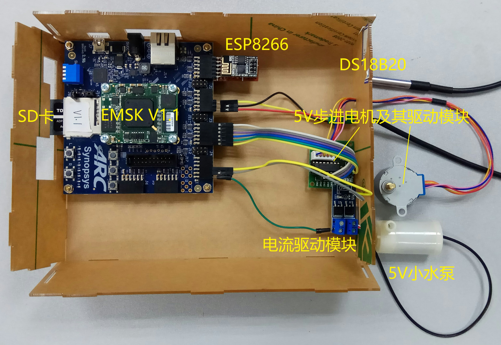

EMSK2作为植物生存维持子系统的控制中心，负责采集花盆土壤湿度、环境中的温度和湿度，通过控制水泵给花盆浇水，对土壤湿度进行调节，使得植物生存在一个相对适宜的环境里。同时通过WiFi上传这些传感器数据和接收控制信号。硬件连接如下图所示。
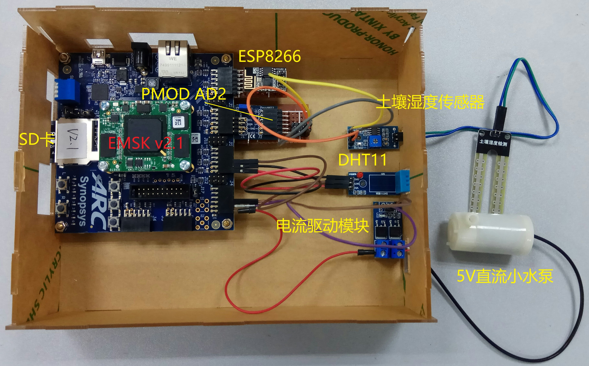

EMSK3作为室内生活环境监控子系统的控制中心，负责采集室内温度、湿度信息，检测可燃性敏感气体、检测光线强度，检测PM2.5含量，通过控制日光灯、排风扇等来对室内光线强度、可燃性气体等进行调节。同时通过WiFi上传传感器数据及接受相应的控制信号。硬件连接图如下。
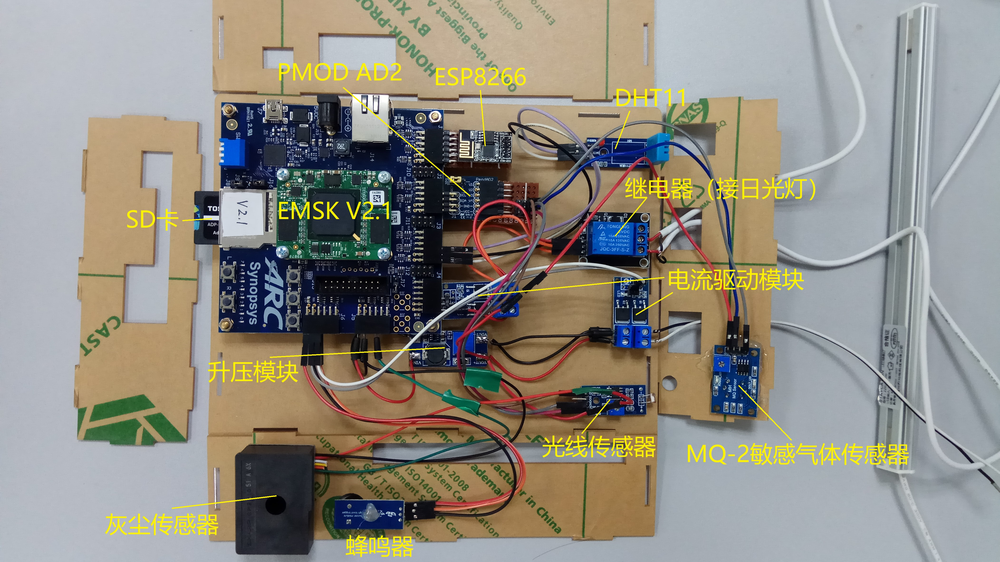

## 用户手册  User manual

### 为ESP8266 ESP01-S WiFi模组烧写GAgent固件

#### 1. 下载ESP8266对应的GAgent固件

[下载地址](https://download.gizwits.com/zh-cn/p/92/94)

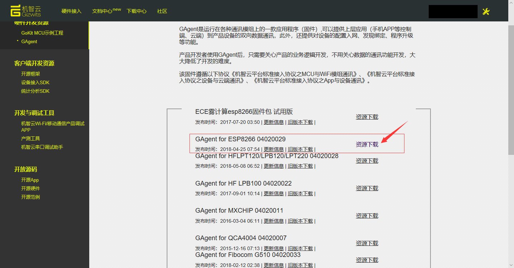

#### 2. 将下载好的GAgent固件解压到本地文件夹

红色线框框选的文件即为所需固件。

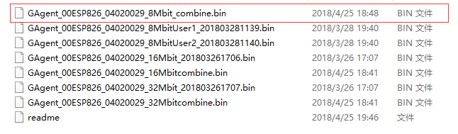

#### 3. 连接设备硬件
将ESP8266模块按照如下原理图进行接线，注意GPIO0需要输入低电平，KEY1实现外部复位功能。

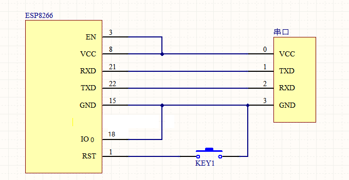

#### 4. 下载烧写软件
下载地址：https://www.espressif.com/sites/default/files/tools/flash_download_tools_v3.6.4.rar

#### 5. 配置烧写软件
打开下载好的烧写软件，按如下图进行配置。

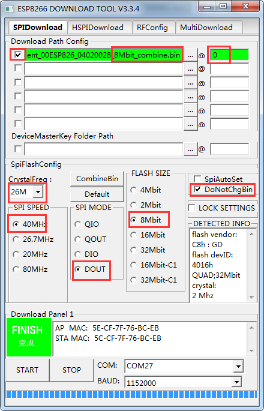

#### 6. 烧写操作

步骤一、选择正确的串口，当串口连接成功后，点击如图“START“按钮，出现等待上电同步

   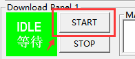    

步骤二、将ESP8266进行复位（按下前图所示的KEY1后松开）将会出现如下信息表示模块正在进行烧写。

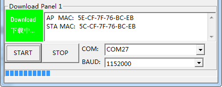 

步骤三、等待一段时间后，出现“FINISH”字样表示烧写成功。

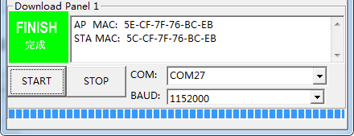 

更多详细信息请参考[机智云网站介绍](http://docs.gizwits.com/zh-cn/deviceDev/ESP8266串口烧写说明.html)

### 编译并运行应用程序

#### 编译之前的准备

- 将src文件夹下的三个源代码文件夹复制到`($embARC)/applications/SmartHomeSystem/` (($embARC)为embARC软件包根目录，以embARC201605版本为例)

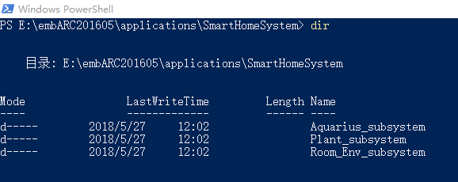

- 将src文件夹下的 dw_uart_obj.c 和 dw_uart_obj.h两个文件复制到 `($embARC)/board/emsk/drivers/uart/`下替换原来的驱动文件。**注意：**替换之前必须对原来的驱动文件进行备份。（替换缘由：手中只有V2.1版本的开发板，而最新版embARC201712版软件包不支持2.1版本的开发板，只能使用embARC201605，但是该软件包不支持使用三个UART串口，所以我们在原有驱动文件的基础上参考最新版软件包对其进行修改，使其可以支持使用3个UART接口）
- 将安卓应用`wifidemo.apk`安装在安卓手机或者平板上，用来查看和控制设备。

#### 1. 编译并运行水族箱子系统应用程序
- 进入Aquarius_subsystem文件夹，根据自己的开发板版本以及处理器型号（**以EMSK V2.1 开发板，em7d处理器为例**）修改Makefile文件。

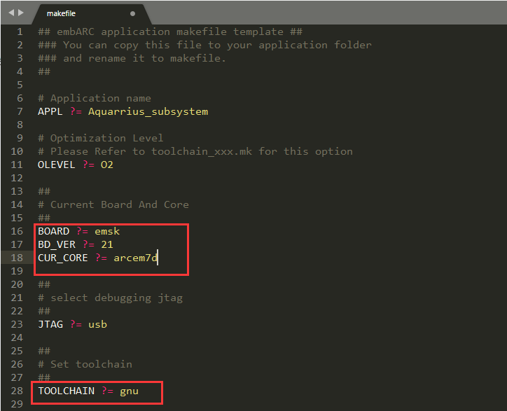

- 在Aquarius_subsystem文件夹中打开CMD或者PowerShell，输入`make`命令进行编译。

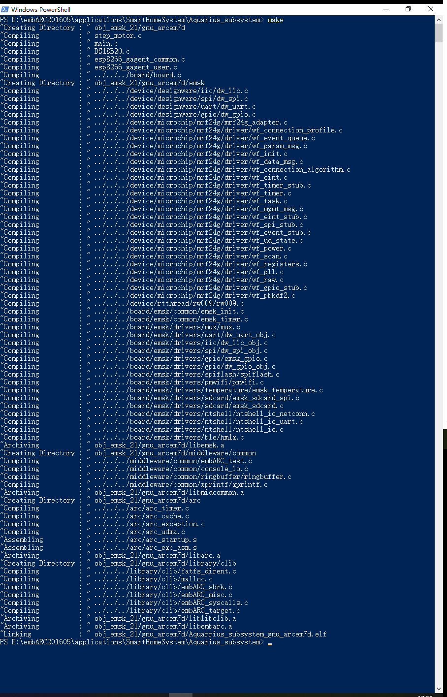

- 使用USB线连接主机和开发板，在CMD或者PowerShell中输入`make run`命令运行目标程序。
- 打开安卓设备端机智云APP，绑定设备并进行控制。

#### 2. 编译并运行植物生存维持子系统应用程序
- 进入Plant_subsystem文件夹，根据自己的开发板版本以及处理器型号（**以EMSK V2.1 开发板，em7d处理器为例**）修改Makefile文件。

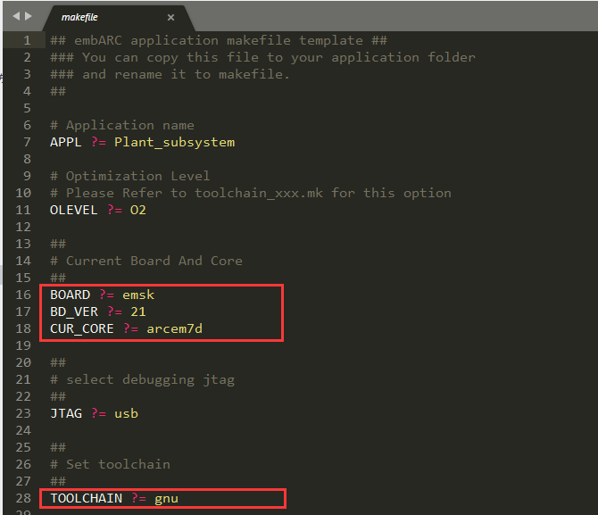

- 在Aquarius_subsystem文件夹中打开CMD或者PowerShell，输入`make`命令进行编译。

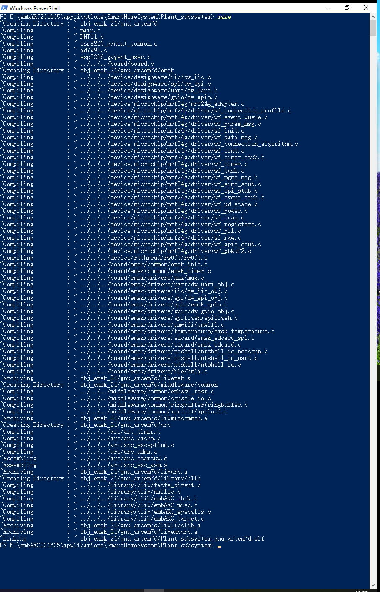

- 使用USB线连接主机和开发板，在CMD或者PowerShell中输入`make run`命令运行目标程序。
- 打开安卓设备端机智云APP，绑定设备并进行控制。

#### 3. 编译并运行室内环境监控子系统应用程序
- 进入Room_Env_subsystem文件夹，根据自己的开发板版本以及处理器型号（**以EMSK V2.1 开发板，em7d处理器为例**）修改Makefile文件。

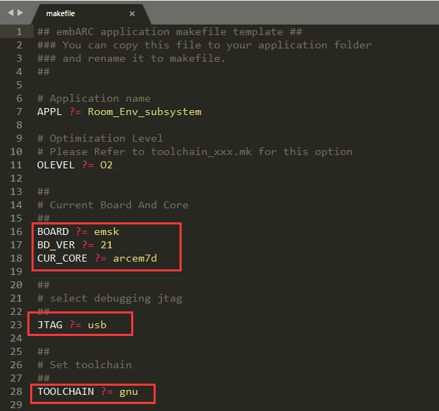

- 在Aquarius_subsystem文件夹中打开CMD或者PowerShell，输入`make`命令进行编译。

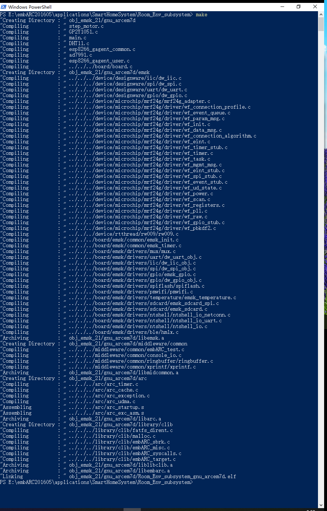

- 使用USB线连接主机和开发板，在CMD或者PowerShell中输入`make run`命令运行目标程序。
- 打开安卓设备端机智云APP，绑定设备并进行控制。

